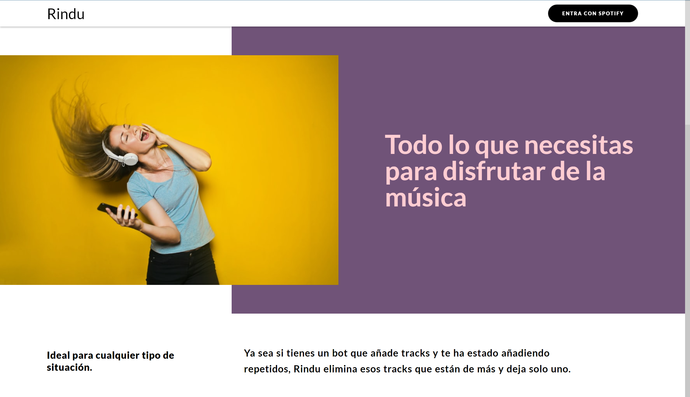
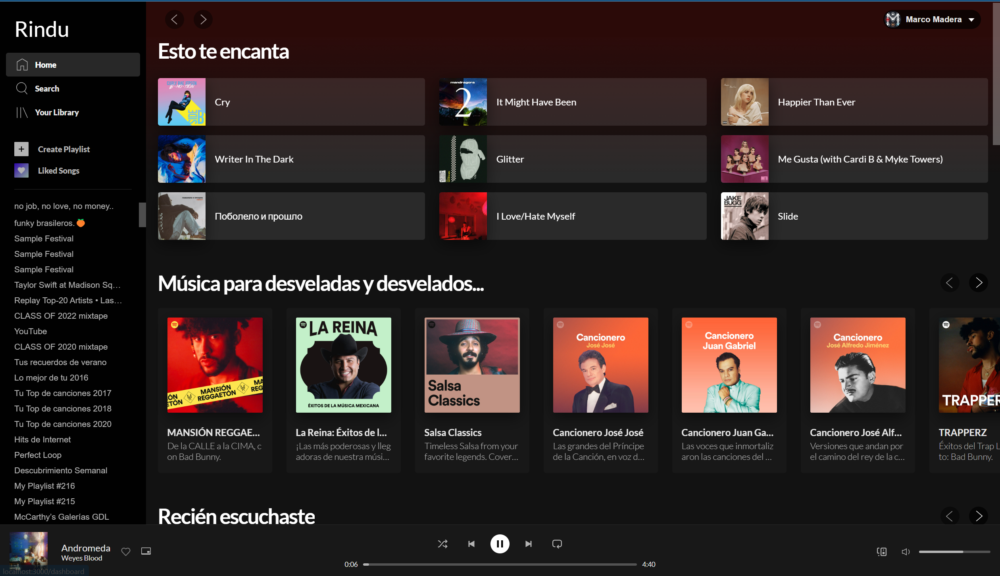

# Spotify playlist Cleaner

Project running at <https://rindu.marcomadera.com>

## **Running Locally**

```bash
git clone https://github.com/MarcoMadera/spotify-playlists-cleaner.git
cd spotify-playlists-cleaner
npm install
npm run dev
```

For the project to work properly a `.env.local` file similar to [`.env.example`](https://github.com/MarcoMadera/spotify-playlists-cleaner/blob/master/.env.example) is required.

**Note:** The `.env.local` file is not pushed to GitHub.

## **Components**

For a better understanding of the components used in this project, please visit the [live component collection](https://main--62c0c8de6b5dd3fac001eb94.chromatic.com) 

## **About the project**

Built with ReactJs/NextJs. It started as a simple script to clean spotify playlists. It served as a way to clean my playlists and to learn how to use the [Spotify API](https://developer.spotify.com/documentation/web-api/).

It has been taking shape similar to what a clone of Spotify is. It is intended to add features such as creating dynamic playlists, advanced search, and background noises.

## Images



